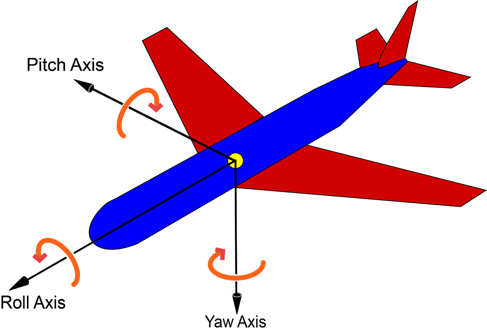
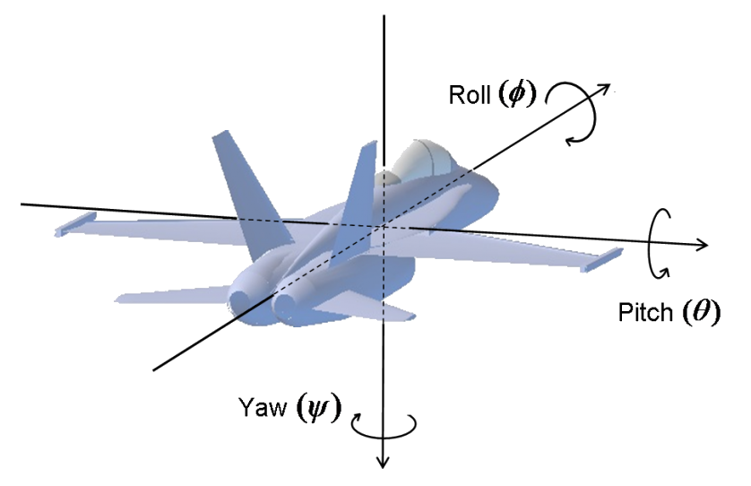
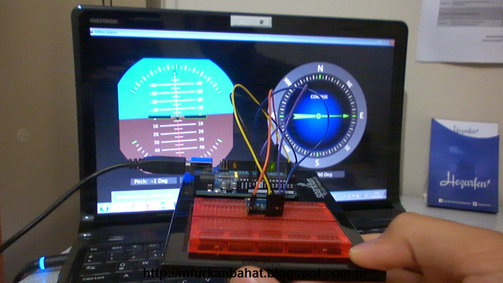

### What Is an Inertial Navigation System?
* [What Is an Inertial Navigation System?](https://dewesoft.com/blog/what-is-inertial-navigation-system)

#### What is an IMU or IMU sensor (Inertial Measuring Unit)?
An IMU is an abbreviation for Inertial Measuring Unit. It is the
sensors, including gyroscopes and accelerometers, that measures
the angular position and displacement of an object in three-
dimensional space.

#### What is an INS (Inertial Navigation System)?

An INS is an abbreviation for Inertial Navigation System. It
includes the IMU sensors and their gyroscopes and accelerometers,
as well as a sensor for receiving absolute position data from
GNSS satellites in space. It may additionally be equipped with
magnetometers for measuring magnetic fields in three-dimensional
space.

An INS adds advanced data processing, including Kalman filtering
and other processing. Referencing the known starting position,
it uses the outputs from the IMU to determine the real-time
position and vector of an object. This “object” can be a car,
submarine, airplane, or any machine that operates in three-
dimensional space.

#### Why do we need inertial navigation systems?

Almost every car, plane, ship and smartphone today has some kind
of navigation system. Your location can be shown on a map using
trilateration position data from GPS/GNSS satellites in space,
or in the case of your smartphone, a trilateration position from
cell phone towers that are at known, fixed locations.

But what if we don’t have access to satellites or cell phone
towers? For example, how does a submarine navigate? Once a
submarine submerges and moves away from a known starting point,
it has no access to satellites or any other external source of
position data.

#### Inertial Navigation Systems (INS)

This is where INS (Inertial Navigation Systems) comes into play.
An INS uses a collection of extremely precise accelerometers,
gyroscopes, and magnetometers combined with advanced processing,
to calculate an object’s position relative to a known starting
point, speed and direction. Once a submarine’s INS is calibrated
to a known reference point, it can “dead reckon” very accurately
from that point forward.

A system that uses “dead reckoning” uses a known starting
position, and then it adds the IMU/INS data to that position in
order to deduce the object’s current position and vector. No INS
is perfect, so inaccuracies will accumulate the longer the
system is a dead reckoning.

#### The IMU: the beating heart of every INS

Inside every INS is the all-important IMU. An IMU is a sensor
package that contains at least three orthogonal gyroscopes and
three orthogonal accelerometers. They are also sometimes equipped
with three magnetometers that measure magnetic dipole moments,
aka magnetic fields. IMUs are used to measure the objects:

	Angular Rate - the rate at which an object is rotating
	around its axis.

	Specific Force - the difference between absolute
	acceleration and gravitational acceleration.

	Orientation - the object’s position in three-dimensional
	space.

Basically, each of the three main axes (X, Y, and Z - also known
as roll, pitch, and yaw) is equipped with at least one gyroscope,
one accelerometer, and (usually) one magnetometer.

Depicted on the followng figure:
* [three principal axes of an aircraft](https://www.datocms-assets.com/53444/1661264842-the-three-principal-axes-of-an-aircraft.png)

The following figure depicts three main axes in Greek Alphabet:
* [Roll - Fi, Pitch - Theta, Yaw - Psi](https://sukeshak.files.wordpress.com/2020/06/roll-pitch-yaw.png)

#### Why do we need three sets of sensors?

A single inertial sensor can only measure along a single axis.
But we move in three-dimensional space, so we mount three
inertial sensors together in an orthogonal cluster.

An inertial system consisting of three accelerometers and three
gyroscopes is called a 6-axis system (two measurements along
three axes is a total of six measurements). When we want to
sense the magnetic fields for navigation purposes, we add a
magnetometer along each axis, for a total of nine sensors.

The 3D model widget in Dewesoft X software allows models to be
displayed in three-dimensional space. An artificial horizon
gauge is also available.

A typical IMU measures the raw angular velocity of the object
that it is connected to. It also measures the specific
force/acceleration and magnetic fields.

When we add advanced signal processing and data filtering such
as Kalman filtering, described in the next sections, our IMU
becomes part of a larger system called an INS or inertial
navigation system. When it is used for navigation, we can also
refer to an INS as an AHRS, or Attitude and Heading Reference
System.

#### What’s the difference between an IMU and an INS?

The IMU (inertial measuring unit) is essentially the sensor
subsystem of an INS (inertial navigation system). The INS takes
the raw outputs from the IMU, processes them, and calculates
changes in an object’s relative motion. The INS references these
changes to the known starting point, speed, and direction,
providing a real-time position and vector output.

IMUs can be completely integrated into an INS, or they can be
separate pieces of hardware that connect to an external INS or
similar system.

The INS calculates and outputs:

	Attitude - pitch, roll, and yaw centered about the
	object’s center of gravity

	Position, Position Velocity, and Orientation - in
	three-dimensional space

	Linear Velocity - a vector quantity that consists
	of both magnitude and direction

	Angular rate - the rate at which an object rotates about its axis

### [DIY] Aircraft/UAV Artifical Gyro Horizon

DIY: abbreviation for Do It Yourself .

#### [DIY] Artificial Horizon and Compass Using Arduino-Processing-MPU6050
* [Artificial Horizon and Compass Using Arduino-Processing-MPU6050](http://mfurkanbahat.blogspot.com/2014/11/artificial-horizon-and-compass-using.html)

In this application MPU-6050 is used to show how to achieve
Artificial Horizon and Compass applications.

All the HW explanation and code is shown in above document.

The Arduino test bed is shown on this picture:

The true features testing is shown on this youtube video:

Artificial Horizon and Compass Using Arduino-Processing-MPU6050
* [Artificial Horizon and Compass Using Arduino-Processing-MPU6050](https://www.youtube.com/watch?v=WTkMdCqo9hg)

#### [DIY] Aircraft/UAV Gyro Horizon (Renesas)
* [Aircraft/UAV Gyro Horizon](https://www.instructables.com/Gyro-Horizon-DIY/)
