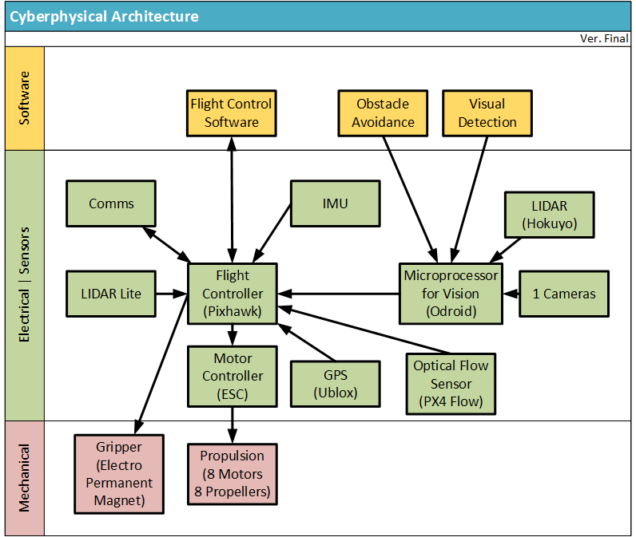

## PX4 Autopilot User Manual
https://docs.px4.io/main/en/

The purpose of this directory is to dive in more details into
the PX4 SW combined with Pixhawk standardized HW.

It is very clear how it works. It will be present in the other
directory of this repo called Pixhawk_Hardware_Architecture/ .

The Cyberphysical-Architecture-v3-Full.png presented here is
just for general view. It will be explained in much more
details in directory Pixhawk_Hardware_Architecture/ .

### Introduction
https://docs.px4.io/main/en/getting_started/px4_basic_concepts.html

### Hardware (Drones & Drone Parts)
https://docs.px4.io/main/en/hardware/drone_parts.html

#### Complete Vehicles
https://docs.px4.io/main/en/complete_vehicles/

##### Flight Controller (Autopilot) Hardware
https://docs.px4.io/main/en/flight_controller/

Please, explore the given pointers, and expand them from the
given documentation. Lot of readings to be done before jumping
into low level design and coding!
