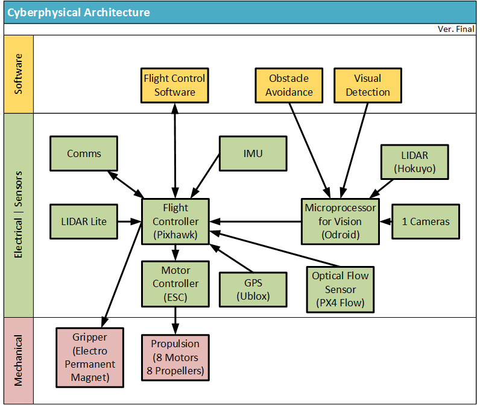

## Pixhawk Hardware Architecture (courtesy Auterion)
https://github.com/pixhawk/Hardware

Let us cut the chase/come to the point and do some real work!

The architecture of the whole drone (very high view level) is
shown on the Cyberphysical-Architecture-v3-Full.png picture.

https://github.com/ZoranStojsavljevic/UAV_State_of_Affairs/blob/main/Pixhawk_Hardware_Architecture/Cyberphysical-Architecture-v3-Full.png

And from this picture, it is very clear how PX4 and Pixhawk
are working alltogether!

### Pixhawk Schematic

It is extracted from Hardware repo (courtesy Auterion):

https://github.com/pixhawk/Hardware

https://github.com/pixhawk/Hardware/blob/master/FMUv3_REV_D/Schematic%20Print/Schematic%20Prints.PDF

It is given as Pixhawk_Schematic_Prints.pdf in here (copied
from the original site):

https://github.com/ZoranStojsavljevic/UAV_State_of_Affairs/blob/main/Pixhawk_Hardware_Architecture/Pixhawk_Schematic_Prints.pdf

There are two major driving elements from the HW schematics.

One is Flight Controller (Pixhawk HW), the another one is a
Microprocessor for Vision (Odroid).

They also communicate. How?

#### Flight Controller (Pixhawk HW)

The heart of the Flight Controller (Pixhawk HW) is a STM's
STM32F407VX controller (Swiss based company).

What is STM32F407VE? A high-performance foundation line, Arm
Cortex-M4 core with DSP and FPU, 512 Kbytes of Flash memory,
168 MHz CPU, ART Accelerator, Ethernet, FSMC.

The data sheet of it is included in this directory:
stm32f407ve.pdf

There is other component called MPU-6000.

The data sheet of it is included in this directory:
MPU-60X0-Datasheet1.pdf

What is MPU-60X0?

The MPU-60X0 is the world’s first integrated 6-axis MotionTracking
device that combines a 3-axis gyroscope, 3-axis accelerometer, and
a Digital Motion Processor™ (DMP) all in a small 4x4x0.9mm package.
With its dedicated I2C sensor bus, it directly accepts inputs from an
external 3-axis compass to provide a complete 9-axis MotionFusion™
output. The MPU-60X0 MotionTracking device, with its 6-axis
integration, on-board MotionFusion™, and run-time calibration
firmware, enables manufacturers to eliminate the costly and complex
selection, qualification, and system level integration of discrete
devices, guaranteeing optimal motion performance for consumers.
The MPU-60X0 is also designed to interface with multiple
non-inertial digital sensors, such as pressure sensors, on its
auxiliary I2C port. The MPU-60X0 is footprint compatible with the
MPU-30X0 family.

This silicon is able to control elements beneath of it:

	- Motor Controllers (ESC)
	- GPS sensor (UBLOX silicon)
	- Optical Flow Sensor (PX4 Flow)

On the top of Pixhawk there is a Real Time (RT) OS running in the
linear space (ARMv7 M4 are non MMU types), outlined as Flight
Control SW (which controls all the aspects of Pixhawk's HW
beneath).

#### Microprocessor for Vision (Odroid)

This silicon is almost always ARMv7 AX (X is usually 8 or 9). it
is an MMU based silicon, thus it is capable of running embedded
Linux. This one is for controlling LIDAR and nowadays 3D cameras.
Why Linux? Linux as by the architecture and capabilities is able
to run such complex LIDAR (Laser Imaging, Detection, And Ranging)
drivers (sometimes > 100K lines of kernel code).

https://en.wikipedia.org/wiki/Lidar

#### Communication Protocol between Pixhawk HW and Odroid

In other words: between Flight Controller (Pixhawk HW) and
Microprocessor for Vision (Odroid)?

Can you tell which one is used? By reading carefully this repo?

Yes, this is MAVLink messaging protocol.

https://mavlink.io/en/

MAVLink is a very lightweight messaging protocol for communicating
with drones (and between onboard drone components).

### Conclusion

Here, the HW architecture with some SW parts of the architecture
is shown. In more details then on the www net pointers.

Hope (?) this does help!

Author
